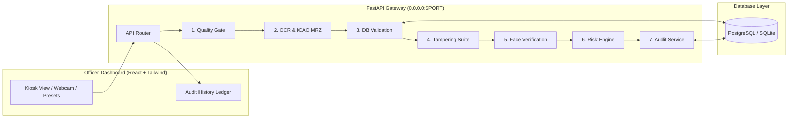

# BorderShield AI: Fake Identity & Document Screening System
**Team:** Da Vinci Code | **Team ID:** 139735 | **Problem Statement ID:** SIH26188  
**Theme:** Blockchain & Cybersecurity | **Event:** Smart India Hackathon 2026

[](https://opensource.org/licenses/MIT)
[](https://fastapi.tiangolo.com)
[](https://react.dev)
[](https://render.com)

An AI-powered document screening platform for border checkpoints that automatically analyzes identity and travel documents (passports, visas, national IDs), detects tampering or forgery, validates information against standard rules and database blacklists, verifies the holder's live face against document photos, and generates an **explainable risk score** to assist human checkpoint officers.

---

## 1. Executive Features

- **Decision-Support (Not Replacement)**: Low risk auto-clears. Medium/High risk always routes to an officer with granular reasons.
- **ICAO 9303 MRZ Engine**: Standard-compliant checksum verification ($7, 3, 1$ repeating weight matrix) on TD3 passports.
- **4-Layer Forensic Tampering Suite**:
  1. *Error Level Analysis (ELA)*: Evaluates JPEG recompression differences and exports visual heatmaps.
  2. *Copy-Move Forgery*: Discovers cloned stamps and characters using ORB keypoint distance clustering.
  3. *Font & Glyph Consistency*: Analyzes character aspect ratios and stroke variance across text fields.
  4. *CNN Classifier*: Patch probability assessment interface for model inference.
- **Biometric Face Verification**: Normalizes and extracts face features to compute cosine similarity with a tolerant threshold for aging/lighting.
- **Transparent Risk Engine**: Weighted sum formula ($0.25 \times \text{MRZ} + 0.30 \times \text{DB} + 0.25 \times \text{Tamper} + 0.20 \times \text{Face}$) with explicit flag generation.
- **Immutable Digital Audit Trail**: Persists every screening and human decision with ISO timestamps.

---

## 2. System Architecture



---

## 3. Technology Stack

- **Backend**: Python 3.10+, FastAPI, Uvicorn, SQLAlchemy, OpenCV, Pillow, NumPy
- **Frontend**: React 18, Vite, Tailwind CSS, Lucide React
- **Database**: PostgreSQL (Render Production) / SQLite (Local Zero-Config Dev)
- **Deployment**: Docker, Docker Compose, Nginx, Render Blueprint (`render.yaml`)

---

## 4. Local Quick Start

### Method A: Local Python & Node (Standard)
1. **Clone the repository**:
   ```bash
   git clone https://github.com/your-org/fake-doc-screening.git
   cd fake-doc-screening
   ```
2. **Start Backend**:
   ```bash
   cd backend
   pip install -r requirements.txt
   python -m uvicorn app.main:app --port 8000 --reload
   ```
3. **Start Frontend (in a separate terminal)**:
   ```bash
   cd frontend
   npm install
   npm run dev
   ```
4. **Access the application**:
   - Dashboard: [http://localhost:3000](http://localhost:3000)
   - API Docs: [http://localhost:8000/docs](http://localhost:8000/docs)

### Method B: Docker Compose (1-Command Startup)
```bash
docker-compose up --build
```

---

## 5. Automated Tests

Execute the full verification suite using pytest:
```bash
pytest tests/ -v
```

Tests cover:
- ICAO 9303 Check digit calculations and character weight algorithms
- TD3 Passport MRZ string parsing and intentional tamper detection
- Database record validation (active, expired, stolen, and blacklisted lookups)
- Transparent weighted risk scoring formula and human-in-the-loop triggers
- Image quality gate blur and illumination filters

---

## 6. Deployment Guide for Render

This repository includes a native **Render Blueprint (`render.yaml`)** that provisions the complete stack automatically.

### Step 1: Upload to GitHub
```bash
git init
git add .
git commit -m "Initial commit: SIH26188 BorderShield AI"
git branch -M main
git remote add origin https://github.com/<your-username>/<your-repo-name>.git
git push -u origin main
```

### Step 2: Deploy via Render Blueprint
1. Log in to [Render Dashboard](https://dashboard.render.com/).
2. Click **New +** $\rightarrow$ Select **Blueprint**.
3. Connect your GitHub repository.
4. Render will parse `render.yaml` and configure:
   - `sih-document-screening-backend` (FastAPI Web Service)
   - `sih-document-screening-frontend` (React Static Site)
   - `sih-screening-db` (PostgreSQL Database)
5. Click **Apply**.

### Step 3: Verify Deployment
- Open the backend URL and check `GET /health` (returns `{"status": "HEALTHY"}`).
- Open the frontend URL to access the live Officer Dashboard.

---

## 7. API Endpoints Reference

| Method | Endpoint | Description |
| :--- | :--- | :--- |
| `GET` | `/health` | Service health status and version metadata |
| `POST` | `/api/v1/screening/screen` | 7-Stage screening pipeline for document & selfie |
| `POST` | `/api/v1/screening/decision` | Human officer decision submission |
| `GET` | `/api/v1/screening/audit-trail` | Immutable checkpoint screening history |

---

## 8. Hackathon Live Demo Flow

1. Open the Officer Dashboard in your browser.
2. Select **"1. Genuine Passport (Vikram Sharma)"** $\rightarrow$ Click **Analyze & Screen Document**:
   - Result: **LOW RISK** (< 30%), recommendation: **Auto-Clear**.
3. Select **"2. Expired Document (Elena Rostova)"**:
   - Result: **MEDIUM RISK**, routes to officer with expiration alert.
4. Select **"3. Blacklisted Record (Marcus Vance)"**:
   - Result: **HIGH RISK**, alerts on Interpol Red Notice in registry.
5. Select **"4. Tampered DOB/Font Splice"**:
   - Result: **HIGH RISK**, shows ELA anomaly and MRZ check digit mismatch.
6. Click **Clear** or **Send to Secondary**, and switch to the **Audit Logs** tab to demonstrate the digital audit trail.

---

## 9. Limitations & Disclosures
Detailed technical boundaries and hardware dependencies are documented in [LIMITATIONS.md](LIMITATIONS.md).
